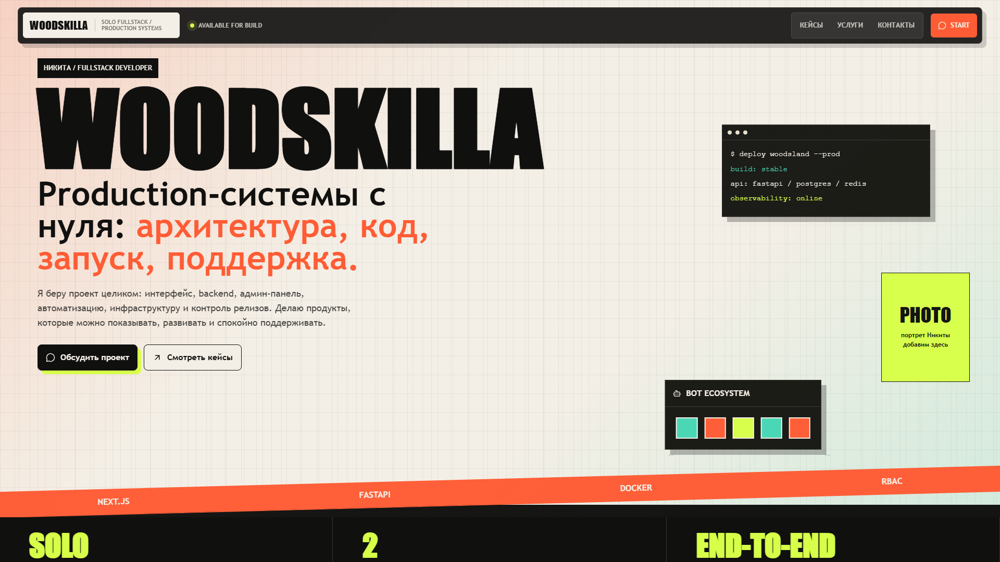
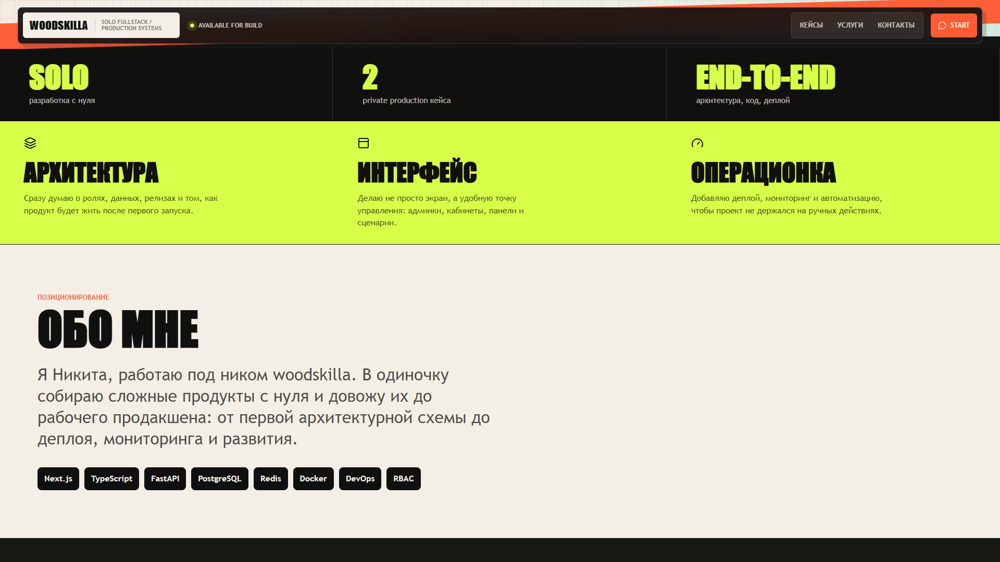
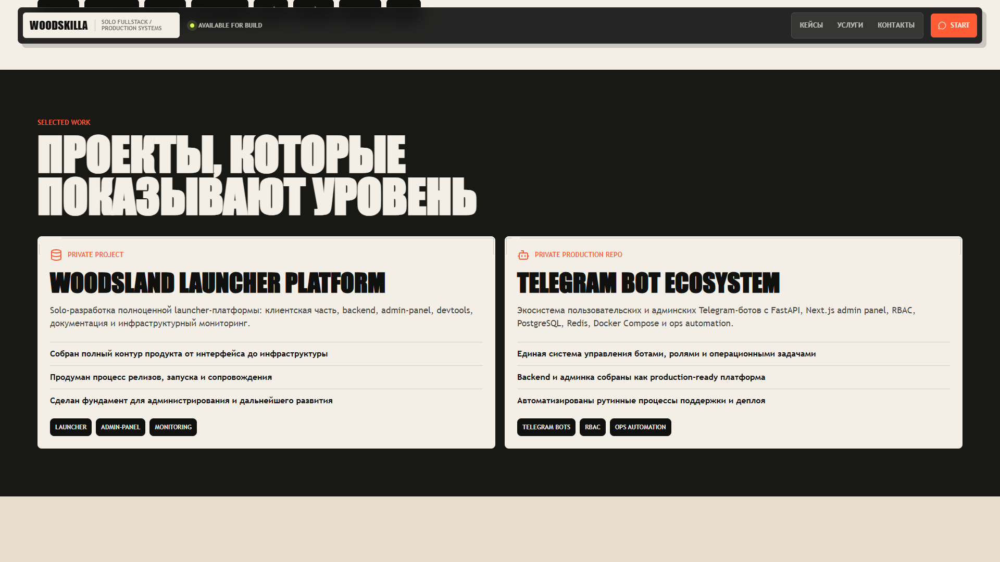

<div align="center">

<a name="readme-top"></a>



# ✨ Modern Portfolio & Landing Page

<p align="center">
  <strong>A sleek, animated, CMS-driven personal website.</strong>
</p>

<p align="center">
  <a href="#english">English</a> • <a href="#русский">Русский</a>
</p>

<p align="center">
  <a href="https://nextjs.org/"></a>
  <a href="https://www.typescriptlang.org/"></a>
  <a href="https://tailwindcss.com/"></a>
  <a href="https://www.sanity.io/"></a>
  <a href="https://github.com/nimalekyt-bit/visitka-site/stargazers"></a>
</p>

</div>

<br/>

<details>
<summary><kbd>Table of contents</kbd></summary>

- [🇬🇧 English](#-english)
  - [✨ Features](#-features)
  - [🚀 Getting Started](#-getting-started)
- [🇷🇺 Русский](#-русский)
  - [✨ Возможности](#-возможности)
  - [🚀 Установка](#-установка)

</details>

<br/>

## 📸 Gallery <a id="gallery"></a>

<p align="center">
  
  
</p>

## 🇬🇧 English <a id="english"></a>

> [!NOTE]
> **Star Us!** If you like this template, please consider giving it a ⭐️!

Your portfolio is your digital handshake. This project is a highly-polished, responsive personal landing page engineered for performance, aesthetics, and ease of content management using Next.js App Router and Sanity CMS.

### ✨ Features

| Highlight | Details |
| :--- | :--- |
| 🎨 **Premium Aesthetics** | Glassmorphism, smooth scrolling, and micro-animations with `Framer Motion`. |
| 📝 **Built-in CMS Studio** | Manage content directly from the `/studio` route without leaving the site. |
| ⚡ **Blazing Fast** | Leverages Next.js server components and optimized image loading. |
| 🛡️ **Bulletproof** | Written in TypeScript. Fallbacks gracefully to local data if CMS is unconfigured. |

### 🚀 Getting Started

1. **Clone & Install**
   ```bash
   git clone https://github.com/nimalekyt-bit/visitka-site.git
   cd visitka-site
   npm install
   ```

2. **Environment Setup**
   Copy `.env.example` to `.env.local` and add your Sanity credentials.
   ```bash
   NEXT_PUBLIC_SANITY_PROJECT_ID=your_project_id
   NEXT_PUBLIC_SANITY_DATASET=production
   ```

3. **Run the Magic**
   ```bash
   npm run dev
   ```
   * Site: `http://localhost:3000`
   * CMS Studio: `http://localhost:3000/studio`

<p align="right"><a href="#readme-top">⤴️ Back to Top</a></p>

---

## 🇷🇺 Русский <a id="русский"></a>

> [!NOTE]
> **Поддержите проект!** Если этот шаблон оказался полезным, поставьте ⭐️ репозиторию.

Стильный, быстрый и современный сайт-визитка, построенный на передовом стеке (Next.js + Tailwind + Framer Motion). Использует Sanity CMS для удобного редактирования проектов через встроенную админку.

### ✨ Возможности

| Фича | Описание |
| :--- | :--- |
| 🎨 **Премиальный дизайн** | Плавные анимации, эффекты матового стекла и адаптивная верстка (Mobile First). |
| 📝 **Встроенная CMS** | Редактируйте текст и проекты прямо на вашем сайте через `/studio`. |
| ⚡ **Оптимизация** | Серверные компоненты Next.js для молниеносной загрузки. |
| 🛡️ **Надежность** | Если база Sanity не настроена, сайт покажет тестовые данные и не упадет. |

### 🚀 Установка

```bash
git clone https://github.com/nimalekyt-bit/visitka-site.git
cd visitka-site

npm install
copy .env.example .env.local  # Укажите свои данные Sanity
npm run dev
```

<p align="right"><a href="#readme-top">⤴️ Back to Top</a></p>
